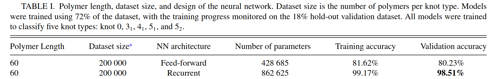
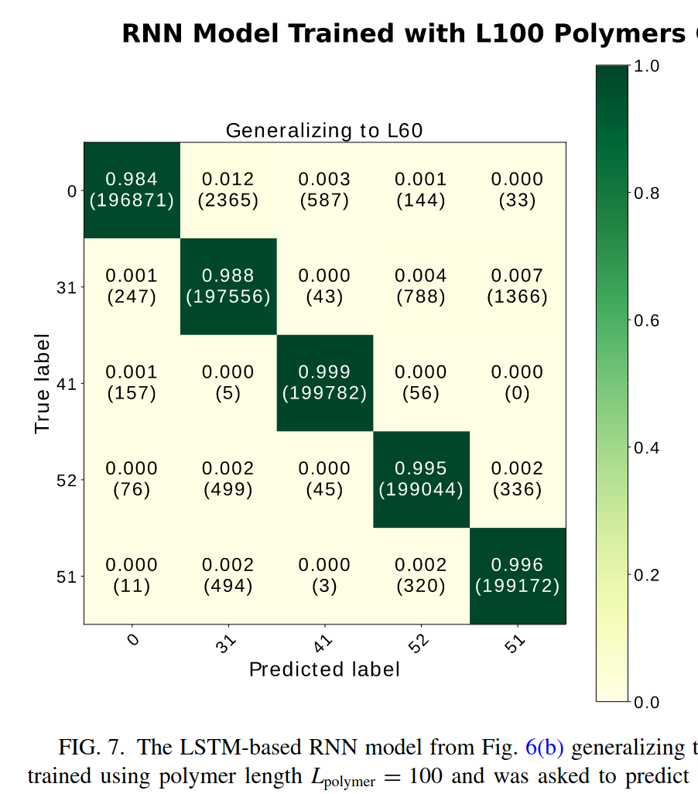

# 🥨 Identify Knot Types by Machine Learning


To mark the 5-year anniversary of the knot type classification project, we release this public repository to provide **a docker, training code, best model with weights, and two showcases of generalizability**.

The work was published in the Physical Review E journal in Febuary 2020 as a research article titled ["Identifying knot types of polymer conformations by machine learning"](https://journals.aps.org/pre/abstract/10.1103/PhysRevE.101.022502):
```latex
@article{PhysRevE.101.022502,
  title = {Identifying knot types of polymer conformations by machine learning},
  author = {Vandans, Olafs and Yang, Kaiyuan and Wu, Zhongtao and Dai, Liang},
  journal = {Phys. Rev. E},
  volume = {101},
  issue = {2},
  pages = {022502},
  numpages = {10},
  year = {2020},
  month = {Feb},
  publisher = {American Physical Society},
  doi = {10.1103/PhysRevE.101.022502},
  url = {https://link.aps.org/doi/10.1103/PhysRevE.101.022502}
}
```

This work, featured as the **APS Editors' Suggestion**, represented one of the first successful attempts of using deep learning to classify different knot types.
It has attracted a number of media coverage since.
- 🥨 **featured in [Nature's Research Highlight: _"A neural network unpicks the knots"_](https://www.nature.com/articles/d41586-020-00483-w)** on 21 February 2020
- 🥨 **featured in [APS Physics Interview: _"Neural Networks Know Their Knots"_](https://physics.aps.org/articles/v13/s19)** on 21 February 2020
- 🥨 **featured in [City University of Hong Kong Research Stories: _"CityU scientists classify knots efficiently with artificial intelligence"_](https://www.cityu.edu.hk/research/stories/2020/04/16/cityu-scientists-classify-knots-efficiently-artificial-intelligence)** on Apr 16 2020
- 🥨 **featured in [Official CityU Research News (in Chinese): _"相比传统算法，人工智能分辨纽结快了20倍！"_](https://mp.weixin.qq.com/s/7Hqq0asBYxdASTVxNUdVLA)** on 29 July 2020

Here we demostrate the training and showcase the generalizability with docker and jupyter notebooks.
The best model with weights are provided in this repo.
The data used in the demo are freely accessible at Zenodo, see Data section for download and extraction instructions.

## Table of Contents 🥨

0. [Data Used in the Demo](#0-data-used-in-the-demo)

## 0. Data Used in the Demo

We release the following data to accompany this demo repo:
- L60 circular knots (`L60_Lp4_D9`) five knot types:
  - Each knot type has 200K conformations, so 1 million conformations in total.
- L100 circular knots (`L100_Lp2_D11`) five knot types:
  - Each knot type has 20K conformations, so 100K conformations in total.

Both the `L60` and `L100` datasets are to classify five knot types: `knot-0`, `knot-31`, `knot-41`, `knot-52`, and `knot-51`.
Each conformation is represented as a txt file of 3D xyz coordinates.

The data are released as open public data on Zenodo at address:...

To download the data from Zenodo, either use command line tools line wget or curl, or directly download by clicking. **Download and save to `./data/` folder.**

To extract the data from `tar.gz`, run the following command:

```sh
# extract the five knot-type tar.gz files
cd ./data
tar -xzvf 1M_L60_Lp4_D9_circular_knot0-31-41-52-51.tar.gz
tar -xzvf ...
```

## 1. Docker with Compatible TF2+CUDA+Py

We provide a `Dockerfile` to build a docker container based on `tensorflow:2.4.0-gpu-jupyter`.
The code we used for development from 5 years ago was based on `tensorflow-gpu==2.0.0`, but now we found the docker image `tensorflow:2.4.0-gpu-jupyter` also works.
The CUDA version for the docker is `CUDA 11`.
The advantage of using tensorflow with docker is you do not need to worry (too much) about CUDA versions.
The notebooks from this repo were generated using a laptop GPU (RTX 3080) with CUDA 11.4.

To build the docker, simply run the provided bash script `build.sh`.
Then launch the docker container by `run.sh`.
Note that we use `docker -v` flag with mounted volume (current dir) for jupyter dir (`/tf`).
The files from the current directory are used for the docker in run-time.

```sh
# create a custom docker image based on:
# - tensorflow:2.4.0-gpu-jupyter and CUDA 11
# - misc packages like matplotlib and scikit-learn
bash ./build.sh

# NOTE: the data are mounted in the next step bash run.sh
# data mounted are:
# - knot data folders
# - the best trained model+weights for inference
bash ./run.sh
```

**`run.sh` will first test if the GPU is avaiable, and then launch a jupyter notebook.**
Simply follow the text prompts and open the URL in your host web browser: `http://127.0.0.1:8888/?token=...`

## 2. Training Code (Demo on L60 200K dataset)

We prepared a **jupyter notbook at [`./Demo_Train_L60_Classifier.ipynb`](./Demo_Train_L60_Classifier.ipynb)**
showcasing how to train a polymer knot-type classifier based on LSTM with Tensorflow.

The dataset used for this training notebook are five knot types of length `L60` and each knot type has 200K conformations.

This tutorial notebook reproduces the **L60 results from Table 1 from our publication**, i.e. training accuracy of ~99%, validation accuracy of ~98%, and evaluation on hold-out testset at ~98% accuracy.




## 3. Best Model with Weights (as trained on L100 2M dataset)

## 4. Showcase 1 on Generalizability (trained on L100 Lp4-D14, predict on Lp2-D11)

## 5. Showcase 2 on Generalizability (trained on L100, predict on L60)


