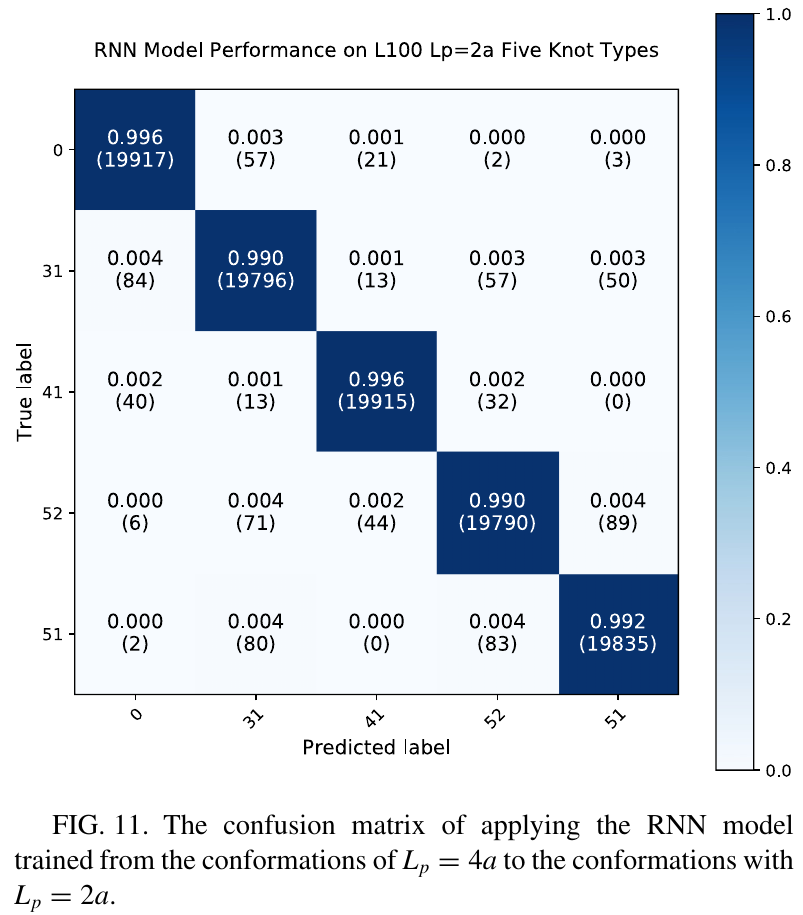

# 🥨 Identify Knot Types by Machine Learning


To mark the 5-year anniversary of the knot type classification project, we release this public repository to provide **a docker, training code, best model with weights, and two showcases of generalizability**.

The work was published in the Physical Review E journal in Febuary 2020 as a research article titled ["Identifying knot types of polymer conformations by machine learning"](https://journals.aps.org/pre/abstract/10.1103/PhysRevE.101.022502):
```latex
@article{PhysRevE.101.022502,
  title = {Identifying knot types of polymer conformations by machine learning},
  author = {Vandans, Olafs and Yang, Kaiyuan and Wu, Zhongtao and Dai, Liang},
  journal = {Phys. Rev. E},
  volume = {101},
  issue = {2},
  pages = {022502},
  numpages = {10},
  year = {2020},
  month = {Feb},
  publisher = {American Physical Society},
  doi = {10.1103/PhysRevE.101.022502},
  url = {https://link.aps.org/doi/10.1103/PhysRevE.101.022502}
}
```

This work, featured as the **APS Editors' Suggestion**, represented one of the first successful attempts of using deep learning to classify different knot types.
It has attracted a number of media coverage since.
- 🥨 **featured in [Nature's Research Highlight: _"A neural network unpicks the knots"_](https://www.nature.com/articles/d41586-020-00483-w)** on 21 February 2020
- 🥨 **featured in [APS Physics Interview: _"Neural Networks Know Their Knots"_](https://physics.aps.org/articles/v13/s19)** on 21 February 2020
- 🥨 **featured in [City University of Hong Kong Research Stories: _"CityU scientists classify knots efficiently with artificial intelligence"_](https://www.cityu.edu.hk/research/stories/2020/04/16/cityu-scientists-classify-knots-efficiently-artificial-intelligence)** on Apr 16 2020
- 🥨 **featured in [Official CityU Research News (in Chinese): _"相比传统算法，人工智能分辨纽结快了20倍！"_](https://mp.weixin.qq.com/s/7Hqq0asBYxdASTVxNUdVLA)** on 29 July 2020

Here we demostrate the training and showcase the generalizability with docker and jupyter notebooks.
The best model with weights are provided in this repo.
The data used in the demo are freely accessible at Zenodo, see [Data](#0-data-used-in-the-demo) section for download and extraction instructions.

## Table of Contents 🥨

0. [Data Used in the Demo](#0-data-used-in-the-demo)
1. [Docker Setup](#1-docker-with-compatible-tf2cudapy)
2. [Training Code](#2-training-code-demo-on-l60-200k-dataset)
3. [Best Model with Weights](#3-best-model-with-weights-trained-on-l100-2m-dataset)
4. [Generalize to L60 Sub-length](#4-generalize-to-l60-sub-length)
5. [Generalize to a Different Bending Stiffness](#5-generalize-to-a-different-bending-stiffness)

## 0. Data Used in the Demo

We release the following data to accompany this demo repo:
- L60 circular knots (`L60_Lp4_D9`) five knot types:
  - Used in Table 1 and Fig. 7 of the publication.
  - Each knot type has 200K conformations, so 1 million conformations in total.
  - Zipped as **`1M_L60_Lp4_D9_circular_knot0-31-41-52-51.tar.gz` [Download](https://zenodo.org/records/10946638)**
- L100 circular knots (`L100_Lp2_D11`) of persistence length `Lp = 2a`:
  - Used in Fig. 11 of the publication.
  - Each knot type has more than 20K conformations, can sample or use all to reproduce Fig. 11 of the paper.
  - Zipped as **`L100_Lp2_D11_circular_knot0-31-41-52-51.tar.gz` [Download](https://zenodo.org/records/10946638)**

Both the `L60` and `L100` datasets are to classify five knot types: `knot-0`, `knot-31`, `knot-41`, `knot-52`, and `knot-51`.
Each conformation is represented as a txt file of 3D xyz coordinates.

The data are released as open public data on Zenodo at **[https://zenodo.org/records/10946638](https://zenodo.org/records/10946638)**
* **`1M_L60_Lp4_D9_circular_knot0-31-41-52-51.tar.gz` [Download](https://zenodo.org/records/10946638)**
* **`L100_Lp2_D11_circular_knot0-31-41-52-51.tar.gz` [Download](https://zenodo.org/records/10946638)**

To download the data from Zenodo, either use command line tools line `wget` or `curl`, or directly download by clicking the download link. **Download and save to `./data/` folder.**

Extract the `tar.gz` data **inside the `./data/` folder**:

```sh
# extract the five knot-type tar.gz files
cd ./data
tar -xzvf 1M_L60_Lp4_D9_circular_knot0-31-41-52-51.tar.gz
tar -xzvf L100_Lp2_D11_circular_knot0-31-41-52-51.tar.gz
```

## 1. Docker with Compatible TF2+CUDA+Py

We provide a [`./Dockerfile`](./Dockerfile) to build a docker container based on `tensorflow:2.4.0-gpu-jupyter`.
The code we used for development from 5 years ago was based on `tensorflow-gpu==2.0.0`, but now we found the docker image `tensorflow:2.4.0-gpu-jupyter` also works.
The CUDA version for the docker is `CUDA 11`.
The advantage of using tensorflow with docker is you do not need to worry (too much) about CUDA versions.
The notebooks from this repo were generated using a laptop GPU (RTX 3080) with CUDA 11.4.

To build the docker, simply run the provided bash script [`./build.sh`](./build.sh).
Then launch the docker container with [`./run.sh`](./run.sh).
Note that we use `docker -v` flag with mounted volume (current dir) for jupyter dir (`/tf`).
The files from the current directory are used for the docker in run-time.

```sh
# create a custom docker image based on:
# - tensorflow:2.4.0-gpu-jupyter and CUDA 11
# - misc packages like matplotlib and scikit-learn
bash ./build.sh

# NOTE: the data are mounted in the next step bash run.sh
# data mounted are:
# - knot data folders
# - the best trained model+weights for inference
bash ./run.sh
```

**`run.sh` will first test if the GPU is avaiable, and then launch a jupyter notebook.**
Simply follow the text prompts and open the URL in your host web browser: `http://127.0.0.1:8888/?token=...`

## 2. Training Code (Demo on L60 200K dataset)

We prepared a **jupyter notbook at [`./Demo_Train_L60_Classifier.ipynb`](./Demo_Train_L60_Classifier.ipynb)**
showcasing how to train a polymer knot-type classifier based on LSTM with Tensorflow.

The dataset used for this training notebook are five knot types of length `L60` and each knot type has 200K conformations.

This tutorial notebook reproduces the **L60 results from Table 1 from our publication**, i.e. training accuracy of ~99%, validation accuracy of ~98%, and evaluation on hold-out testset at ~98% accuracy.


## 3. Best Model with Weights (trained on L100 2M dataset)

The best RNN model for `L100` was a bidirectional LSTM stack with dropout trained on 2 million conformations for each knot type. The model with weights can be loaded directly (~10 MB) from this repo at **[`best_models/temp_20191103-175055_L100_2M_0-31-41-52-51-relative_BiLSTM240BiLSTM200Dp20BiLSTM180BiLSTM180BiLSTM100_.h5`](best_models/temp_20191103-175055_L100_2M_0-31-41-52-51-relative_BiLSTM240BiLSTM200Dp20BiLSTM180BiLSTM180BiLSTM100_.h5)**,
using `keras.models.load_model()`:

```py
# Best RNN model:
# Nov03 99.59acc BiLSTM stacks
best_model_dir = "best_models/"
save_model_name = best_model_dir + \
    "temp_20191103-175055_L100_2M_0-31-41-52-51-relative_BiLSTM240BiLSTM200Dp20BiLSTM180BiLSTM180BiLSTM100_.h5"

print("model to be used: ", save_model_name)

model = keras.models.load_model(save_model_name)

model.summary()
```

## 4. Generalize to L60 Sub-length

The notebook **[`./Generalize_SubLength_L60_Fig7.ipynb`](./Generalize_SubLength_L60_Fig7.ipynb)**
showcases the generalizability of `L100` classifier to identify knots in sublength polymer `L60`.
The model was
trained using polymer length `L100` and was asked to predict knot type labels on 1 million `L60` polymers.
This tutorial reproduces the Figure 7 (left panel) from the publication


## 5. Generalize to a Different Bending Stiffness

This notebook **[`./Generalize_Bending_Stiffness_Fig11.ipynb`](./Generalize_Bending_Stiffness_Fig11.ipynb)** loads the best weights for a trained model on `L100`, and predicts on unseen new conformations with **a different bending stiffness**.

In the body of the paper, the polymer conformations are
generated with a persistence length `Lp = 4a`. To examine
whether our model also works for polymer conformations with a
different bending stiffness, we generate `20 000` conformations
of `Lpolymer = 100` and `Lp = 2a` for each of the five knot types.
Then, we apply the RNN model trained from conformations with `Lp = 4a` to classify these new conformations with
`Lp = 2a`. The prediction accuracy is above `99%` for every
knot type, as shown in the Fig. 11 of our PRE publication:


These results suggest that the
prediction accuracy of our NN is insensitive to the bending
stiffness.
